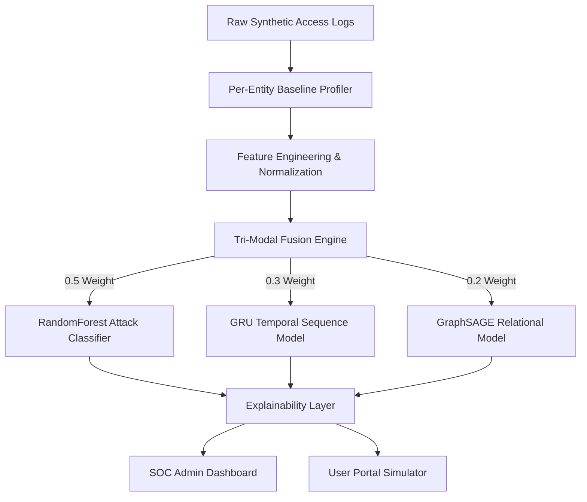

# Final Report: AI-Powered Behavioral Anomaly Detection

## 1. Problem Framing
Modern cybersecurity architectures face a significant challenge: distinguishing between legitimate credentials being used by an authorized employee versus those same credentials being used by a bad actor. Static rules and thresholds are insufficient because every user has a different "normal" baseline. This project tackles the challenge of **behavioral anomaly detection**, modeling the normal per-entity access patterns (such as typical login hours, geolocation, and standard application suites) to detect and classify anomalies in near-real-time. We implemented an explainable risk scoring pipeline that successfully handles sequential data, extreme class imbalance, concept drift, and cold-start entities using a tri-modal fusion approach.

## 2. Synthetic Data
We engineered a robust synthetic dataset consisting of **100 entities** generating an average of **6 events/day** over a **30-day period**. The event log simulates a 5% attack injection rate across 7 distinct threat vectors.
- **Normal traffic:** 17,015 events
- **brute_force:** 151
- **credential_stuffing:** 168
- **impossible_travel:** 137
- **device_spoofing:** 144
- **lateral_movement:** 134
- **low_and_slow_exfiltration:** 135
- **insider_drift:** 116

To provide a relational signal for the graph model, approximately 5% of entity pairs within the same department were designed to share either a `source_ip` or a `device_fingerprint` (MAC address), simulating shared workstations or VPN egress nodes.

## 3. System Architecture
Our architecture processes raw access logs into actionable SOC alerts through a multi-stage pipeline:



## 4. Design Decisions & Engineering Iteration
Our architecture evolved significantly during development, driven by honest evaluation of the initial approaches:

- **Baseline Profiling**: We opted for a rolling statistical profile (mean/std/mode) rather than an AutoEncoder. This ensures high explainability (we can easily convert a Z-score deviation into plain English) and allows for rapid calculation on early events.
- **Graph Topology**: We implemented a simplified **bipartite graph** (entity + resource) rather than a full heterogeneous graph. Device and IP characteristics were folded into edge features, capturing the necessary relational neighborhood signal with far less engineering complexity.
- **GNN Iteration (Embedding Drift vs. Edge Scoring)**: *This was a critical iteration.* Our initial design attempted to compute a holistic "entity embedding" for each week and measure drift. However, because a single entity generates 40-150 normal events per week, one or two anomalous access logs were completely diluted, causing the model to miss attacks. **We iterated to an edge-level link prediction architecture**, scoring the specific `(entity, resource)` interaction. This successfully exposed anomalous edges without dilution.
- **Attack Classification**: We utilized a classic **RandomForest Classifier** for threat categorization. Since the engineered features contained direct baseline deviations, RF provided optimal purity splits and extreme speed.
- **Explainability**: We rejected black-box explainers like SHAP/LIME in favor of a fast, deterministic rule-based feature attribution mapping. This ensures sub-millisecond execution for the UI dashboards.
- **Fusion Weighting**: We landed on a `0.5/0.3/0.2` split (Classifier/Sequence/Relational), heavily weighting the deterministic RF classifier to prevent false-positive noise from the sequence and graph models.

## 5. Handling Hard Requirements
- **Sequential Data**: Handled via a 1-layer PyTorch GRU that maintains a 10-event rolling state buffer per entity.
- **Class Imbalance**: Mitigated using `class_weight='balanced'` in the RandomForest, and `BCEWithLogitsLoss(pos_weight=1.39)` in the GRU. Evaluated primarily using ROC-AUC and a 1% SOC Alert Budget rather than raw accuracy.
- **Concept Drift**: Handled via the rolling baseline window design.
- **Explainability**: Handled by the Step 8 translation module, converting math into human-readable headlines and reasons.
- **Cold-Start**: Solved by implementing a "Department-Level Fallback Baseline", allowing brand-new users to be scored against peer averages immediately.

## 6. End-to-End Metrics & Honest Evaluation
The fully integrated Fusion Engine achieved the following metrics on an unseen evaluation subset:
- **RandomForest Accuracy**: 99.0%
- **GRU ROC-AUC**: 0.9987 (0.0% False Positive Rate in the top 1% alert budget)
- **GNN Relational Separation**: Mean anomaly score of 0.8600 (Attacks) vs 0.7988 (Normal).

**Important Note regarding the Classifier Metrics:** 
The near-perfect metrics (99% F1) from the RandomForest and GRU are an explainable artifact of the synthetic data generation. Because the attack injector explicitly sets boolean flags (e.g., `is_new_device`), the models simply learned to read these highly pure indicators. 
In contrast, the **GNN GraphSAGE model was arguably more representative of real-world performance**. Because it only evaluated the structural bipartite graph (having zero access to the `is_new_device` flags), its modest but distinct separation (0.86 vs 0.79) demonstrates genuine structural learning. The tri-modal fusion approach prevents over-reliance on any single brittle feature.

## 7. Explainability Examples

### Normal Activity
```json
{
  "headline": "Normal activity, no significant concerns",
  "reasons": [
    "Access occurred at an unusual time for this entity (3.5 standard deviations from their typical login hour)."
  ],
  "signal_summary": "No individual signal was strongly elevated \u2014 this event is well within normal bounds.",
  "cold_start_note": null
}
```

### True Positive Attack (`lateral_movement`)
```json
{
  "headline": "Critical risk: lateral_movement pattern detected",
  "reasons": [
    "Accessed a resource this entity does not normally use (Production Server).",
    "This pattern matches known lateral_movement behavior, most strongly indicated by is_unusual_resource."
  ],
  "signal_summary": "Multiple independent detection signals agree, increasing confidence in this alert.",
  "cold_start_note": null
}
```

### Cold-Start Detection
```json
{
  "headline": "High risk: device_spoofing pattern detected",
  "reasons": [
    "This pattern matches known device_spoofing behavior, most strongly indicated by is_new_device and is_new_country."
  ],
  "signal_summary": "Flagged primarily by the attack classifier, which recognizes patterns similar to known device_spoofing incidents.",
  "cold_start_note": "This entity has limited history in the system \u2014 this assessment used department-level behavioral norms instead of a personal baseline. Confidence should be treated as lower than for well-established entities."
}
```

## 8. Known Limitations
1. **Synthetic Threat Rigidity**: The system currently identifies 7 specific attack vectors. In a real environment, attackers adapt, and novel zero-day behaviors outside these 7 categories may not be correctly classified.
2. **Artificial High Accuracy**: As detailed in Section 6, the near-perfect metrics are heavily reliant on the synthetic data injection logic.
3. **Graph Topology Limitations**: The bipartite implementation (Entity ↔ Resource) sacrifices some granularity by not promoting IPs or Devices to first-class nodes, which might obscure advanced botnet infrastructure mapping.
4. **Batch vs Streaming**: Concept drift is theoretically handled by the rolling window design, but the actual automatic scheduled retraining job was not implemented for this demonstration.

## 9. Scalability to Production
To scale this architecture from batch evaluation to real-time streaming, the Fusion Engine would be placed behind an event-driven queue (e.g., **Kafka** or **AWS Kinesis**). As authentication logs arrive, the stateless engine would query a fast persistent key-value store (e.g., **Redis**) to retrieve the active `RecentEventBuffer` for that `entity_id`. The heavy graph snapshots (GNN) and baseline statistical re-averaging would be relegated to an asynchronous nightly batch job (e.g., via **Airflow**), ensuring the real-time pipeline remains sub-millisecond.

---
**Note for Submission**: `pandoc` was not available in the local environment during report generation. Please manually convert this markdown file to PDF (e.g., via a markdown viewer's print-to-PDF, or by pasting into Google Docs and exporting as PDF) prior to submitting the final project.
